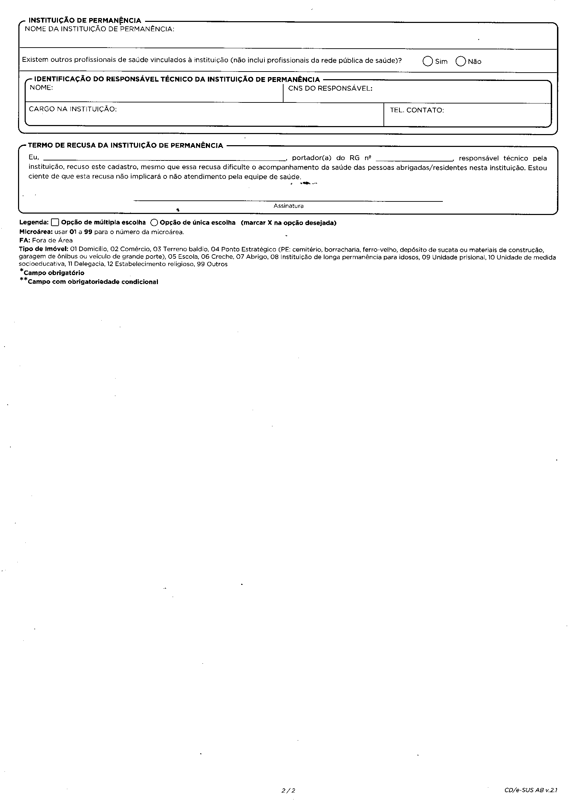

# ACS_area
Plataforma de CRUD de casas e pessoas econntrole que comummente um agente comunitario de saude usa


o projeto ainda em faze planejamento 
e esta sendo desenvolvido com a intenção de ajudar minha mae que é agente comunitaria de saude pra ela nao estar tendo que escrever tudo e na mao

```diff
! projeto ainda em andamento
! esquema esta sendo montado em html e css mas sera passado para alguma lib
+ React ou Vue
```

- imagens de cadastros manuais
cadastro domiciliar

cadastro domiciliar costas

cadastro individual

cadastro individual costas


mas alguns pontos sao importantes de se resaltar que são
- [] sera feito crude - cadastro individual
- [] sera feito crude - cadastro domicialiar
- [] tera um metodo findAll pra pessoas - listar todos
- [] tera um metodo findAll pra domicilios - lista todos
- [] sera possivel atualizar os cadastros de ambos - update
- [] sera possivel deletar um cadastro em ambos os crudes
- [] sera possivel buscar apenas um cadastro em abos os crudes

## Api, banco de dados ainda sendo analizado 

- api em node ? 
- crude no firebas ?
